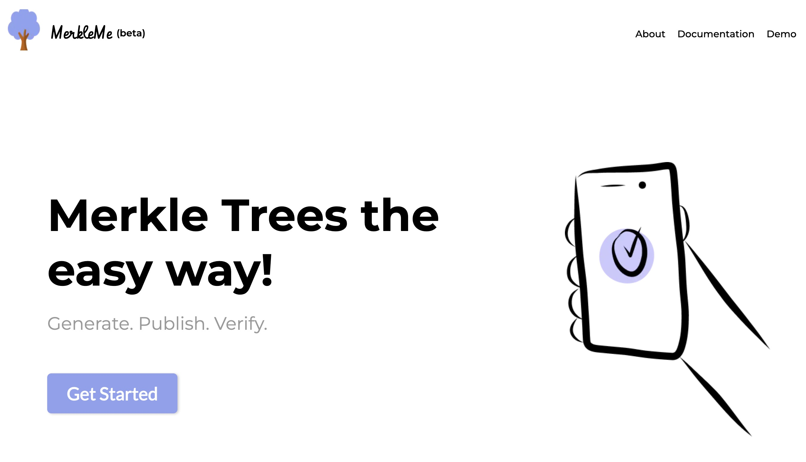
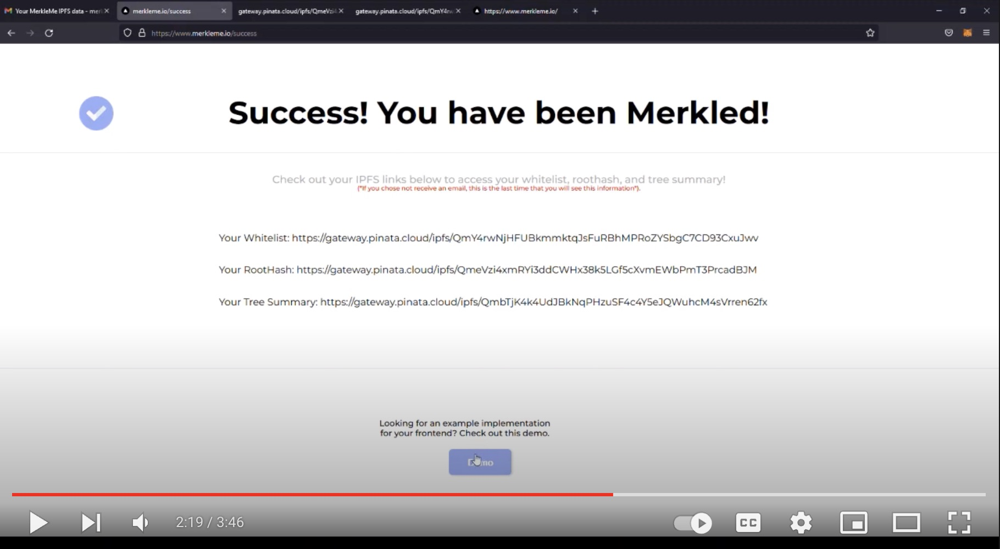

## Description

[MerkleMe.io](https://www.merkleme.io) is a prototype I created as a team of 4 for the [web3con](https://www.web3con.dev) hackathon. It is an API that allows for quick and easy generation of Merkle Trees and Proofs.

The idea for this project arose as we were searching for a way to verify sets of data (e.g. a "whitelist") in a decentralised manner. Merkle trees, it turns out, are being increasingly used in web3 projects for eactly this purpose. Without a centralised database, and to avoid saving large datasets "on-chain", merkle tree verification allows short hashes of that data to be sent and compared instead of the actual files or datasets themselves. When there's a match, you know the data is valid and can proceed. This saves bandwidth, time, and money.

In reality, merkle trees are a lot more complex than this, and they're even used in consistent hashing algorithms, git, and most famously blockchain technology. The best, most concise explanation I've seen of merkle trees and why they're so useful is here: [How Merkle Trees Enable the Decentralised Web](https://www.youtube.com/watch?v=YIc6MNfv5iQ). To get a better understanding of why they're commonly used in web3 projects, check out this article: [Using Merkle Trees for NFT Whitelists](https://medium.com/@ItsCuzzo/using-merkle-trees-for-nft-whitelists-523b58ada3f9)

With that in mind, MerkleMe.io abstracts away most of the merkle tree creation and proof generation (the proof is what is needed to verify the data on the contract side -- think of it as kind of "key"). The relevant data is also saved to and retrieved from [IPFS](https://ipfs.io/), a distributed peer-to-peer file storage system.

### Preview

Click the thumbnail above to watch a walkthrough of MerkleMe.io, and check out the code on GitHub >>

 - [API Server](https://github.com/nfgenes/merkleme_api)
 - [React Frontend](https://github.com/nfgenes/merkleme)

### Objective

As more and more creators are looking for good decentralised solutions for creating and verifying NFT whitelists, we noticed that merkle trees were getting more attention as a solution, but that they were a bit cumbersome for uninitiated developers. Therefore, we sought to create a solution that could abstract away the implementation and proof generation steps, so that web3 developers would only have to hit the MerkleMe api endpoint via their UI, and then verify the proof on their solidity contract.

The focus here was also to build an interesting, creative prototype around a novel idea for the hackathon, but with real usability. So far, although it's still a rough draft, we've gotten positive feedback from the community :)
